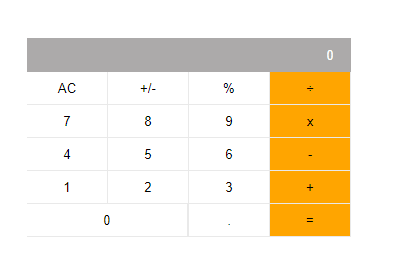

# Math Magician

> The project is about creating a react app called math magician based on a calculator

## Built With

- Javascript
- React
- HTML
## Live Demo

[Live Demo Link](https://lichapa-mathmagician.netlify.app/)

## Getting Started
To get a local copy up and running follow these simple example steps.

- Clone the repository: [git@github.com:Lichapa/math-magician.git](git@github.com:Lichapa/math-magician.git)
### Prerequisites
- Have a web browser installed
- Have VSCode Editor Installed
### Setup
- Clone the repository: [git@github.com:Lichapa/math-magician.git](git@github.com:Lichapa/math-magician.git)
### Install
run `npm install` to install modules in local environment
### Usage
run `npm start` to run the app in server
## Authors
### Mphatso Lichapa
- GitHub: [@Lichapa](https://github.com/Lichapa)
- Twitter: [@LichapaMphatso](https://twitter.com/LichapaMphatso)
- LinkedIn: [mphatsolichapa](https://www.linkedin.com/in/mphatsolichapa)

## 🤝 Contributing

Contributions, issues, and feature requests are welcome!

Feel free to check the [issues page](../../issues/).

## Show your support

Give a ⭐️ if you like this project!

## 📝 License

This project is [MIT](https://mit-license.org/) licensed

## Learn More

You can learn more in the [Create React App documentation](https://facebook.github.io/create-react-app/docs/getting-started).

To learn React, check out the [React documentation](https://reactjs.org/).

